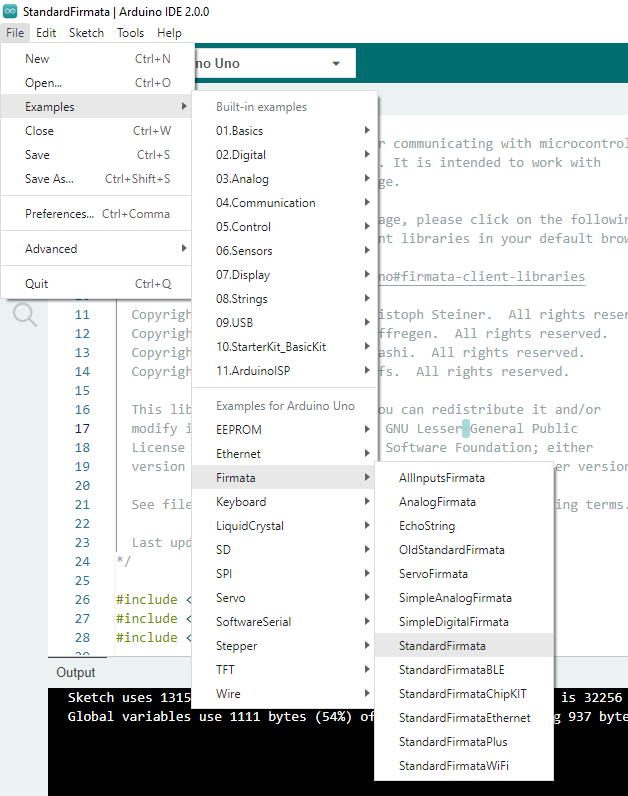

# firmatazero [](https://github.com/psf/black)

The simplest Python interface for controlling pins on Arduino by using [Firmata](https://github.com/firmata/protocol) protocol.

This project aims to bring [GPIO Zero](https://github.com/gpiozero/gpiozero)'s excellent Python interface from Raspberry Pi's to Arduinos, while making only minor adjustments that make sense in due to different hardware. This means that in some cases **existing gpiozero code can work on Arduino by simply changing imports and pin numbers**.

Firmatazero automatically detects Arduino's port and on default expects Arduino Uno, and is thread safe.

Blink example:

```python
from firmatazero import LED
from time import sleep

led = LED(13) # 13 == LED_BUILTIN

while True:
    led.on()
    sleep(1)
    led.off()
    sleep(1)
```

Servo example:

```python
from firmatazero import Servo
from time import sleep

servo = Servo(9)
while True:
    servo.min()
    sleep(1)
    servo.mid()
    sleep(1)
    servo.max()
    sleep(1)
```

Needless to say, this project is heavily inspired by [GPIO Zero](https://github.com/gpiozero/gpiozero). This means that the project structure and docstrings are very related, even if the underlying code is different.

This project is build with [pyFirmata2](https://github.com/berndporr/pyFirmata2) and [pySerial](https://github.com/pyserial/pyserial) libraries.

Currently has very limited amount of devices. Used in [botafar.com](https://botafar.com/) for making shareable, realtime global remote controls possible for robotics projects.

## Installation

Python side:

```
pip install firmatazero --upgrade
```

Arduino side: on Arduino IDE select `File > Examples > Firmata > StandardFirmata`.



Then select your board and port from `Tools > Board` and `Tools > Port`. Then press `Upload`.

## Supported devices

You can use GPIO Zero's docs, if you take changes intpo account:

### DigitalOutputDevice

Same as GPIO Zero's [LED](https://gpiozero.readthedocs.io/en/stable/api_output.html?highlight=OutputDevice#digitaloutputdevice), except:

- `blink()` not implemented
- `pin_factory` does not have an effect

### LED

Same as GPIO Zero's [LED](https://gpiozero.readthedocs.io/en/stable/api_output.html?highlight=Servo#gpiozero.LED), except: 

- `pin` parameter has a default value of 13, the buildin LED
- `blink()` function and `active_high` parameter not implemented
- `pin_factory` does not have an effect

### Servo

Same as GPIO Zero's [Servo](https://gpiozero.readthedocs.io/en/stable/api_output.html?highlight=Servo#gpiozero.Servo), except: 

- `pin` parameter has a default value of 9, the pin used in [Knob and Sweep examples](https://docs.arduino.cc/learn/electronics/servo-motors)
- `min_pulse_width` and `max_pulse_width` have default values from [Arduino Servo.h](https://github.com/arduino-libraries/Servo/blob/master/src/Servo.h#L82) library, this means that most hobby servos move 180 degrees out of the box
- `detach()` function not implemented, so `Servo.value = None` is not allowed
- `pin_factory` does not have an effect

## New functions

- **detect_port()** detects and returns the first Arduino port it finds, or raises RuntimeError
- **set_port(port)** allows skipping port autodetection, for example: `set_port("COM1")`
- **set_board(board)** allows setting another pyFirmata2 board or settings compared to the default one, for example: `set_board(pyFirmata2.ArduinoMega("COM4"))`
- **get_board** get pyFirmata2 board shared with all devices, to run some custom code with

# Contributing

Contributions are very welcome. Anything that makes this project to support more GPIO Zero's Devices are very welcome.